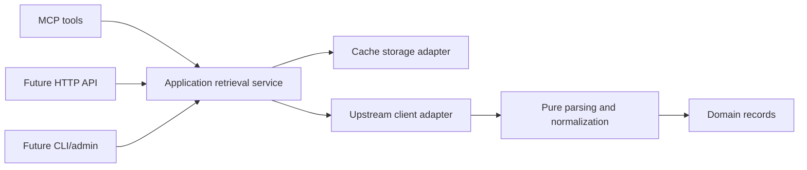

# Rust architecture

## Status and decisions

The server foundation is implemented in `apps/server` as one library/binary package.
It provides a startup tool registry and endpoint supervisor shared by Streamable HTTP
and WebTransport adapters. The production binary requires both, plus a private
health listener. Shared retrieval, memory caching, two pure synthetic processors,
and React MCP Apps widgets are implemented. Supplied-text comparison uses a bounded
Rust worker adapter and a separate transient result store. Real legal-data models
and providers remain planned. The [server contract](server.md) owns the
implemented extension interfaces and transport configuration.

A standalone [search-query processor](search-query.md) now parses supplied query
syntax into domain-owned expressions. It has no evaluator or serving integration;
the existing synthetic search and historical query validation remain unchanged.

- Support multiple jurisdictions without imposing one provider's identity or
  date semantics on all records.
- Start provider coverage with Korean national legislation and history.
- Serve hosted MCP first, with a possible public HTTP API sharing application services.
- Start with one hosted backend instance. Multiple replicas require the
  [coordination design](upstream-policy.md#coordination-and-request-budgets).
- Keep a small workspace, extracting additional crates only for an identified need.

## Responsibility map

The server, domain, normalization, application, and adapters contain working
implementations. Their initial data model is explicitly synthetic; it does not
preempt future evidence-backed legal mappings. The CLI remains planned.

| Component | Responsibility | Project dependencies |
| --- | --- | --- |
| `crates/domain` | Synthetic record/query types, search-syntax expressions, supplied-text comparison contracts, provenance, freshness and errors; legal models remain future work | No other project layer |
| `crates/normalization` | Pure parsing, search-query syntax processing, and provider-specific normalization modules | Domain |
| `crates/application` | Retrieval use cases and supplied-text comparisons; freshness, refresh, coalescing, retention and budgets; operation interfaces | Domain |
| `crates/adapters` | Separate modules for upstream HTTP, cache storage, and bounded Rust comparison workers | Application interfaces, domain, normalization |
| `apps/server` | Configuration, immutable tool/resource registries, worker/endpoint supervision, HTTP/WebTransport and private health | Application/adapters/normalization through demo composition; domain for typed tool results |
| `apps/widget` | React presentation and MCP Apps host bridge; no source fetching or cache policy | MCP wire contracts |
| `apps/cli` | Future CLI/admin commands and composition | Application and adapters; not server routing |

Within adapters, keep each provider's transport and each storage implementation in
responsibility-focused modules. The adapters crate is not a general utility crate.

## Dependency and side-effect boundaries

Domain code owns representations and invariants, not network, storage, filesystem,
MCP, or HTTP-server behavior. It must not depend on those implementations.

Parsing and normalization accept supplied bytes/values and explicit context and
return typed records, diagnostics, or errors. They do not read files, contact
networks, access databases or environment variables, read the clock, or depend on
MCP/HTTP serving. Fetching referenced resources is an explicit application action,
never a parser side effect. Keep provider-specific mapping modules distinct.

Application services define narrow interfaces for upstream and storage operations.
Concrete adapters implement those interfaces; application code does not import the
adapters crate. Put operation policy in application services and mechanics in
adapters. In particular, storage does not decide legal freshness, and transport
does not create an independent retry loop outside the shared request budget.

The text-comparison service owns admission, transient result retention and paging.
Its adapter runs `similar` in a killable mode of the server executable, passing
inputs through pipes. The application owns the typed patch-and-highlights engine
interface and validates worker results before paging/publication. Public scalar
range representations belong to domain. This is not a normalizer or retrieval
cache implementation; callers cannot choose executables, paths or options. The
sole public mutation deletes a temporary comparison using its bearer handle; generic module registration remains read-only. See the
[text comparison contract](text-diff.md) for bounds and lifecycle.

The composition entrypoint loads configuration, constructs adapters and shared
state, and connects them to application services. Explicitly supply time and other
environmental dependencies to policy logic so it can be tested deterministically.

## Retrieval flow

Arrows show execution flow, not Cargo dependencies. Application operations use
their interfaces; the entrypoint wires concrete adapters. An upstream adapter may
pass retrieved bytes to the normalizer, but the normalizer never initiates I/O.

Application services select cached data, arrange bounded/coalesced refresh when
needed, and publish validated records and provenance through storage interfaces.
They expose enough retrieval metadata for transports to honor the
[freshness contract](upstream-policy.md#freshness-and-failure-behavior).

The [retrieval contract](retrieval.md) documents implemented source registration,
processing, memory storage, and service lifecycle. Explicit persistent mode uses [PostgreSQL 18 and BlobStore](persistence.md):
PostgreSQL owns query identity, current heads, immutable history, provenance and
retention metadata; the provider-neutral blob port owns immutable source bytes.
The initial filesystem blob adapter performs bounded owned work outside application
locks. Database transactions never span upstream requests, blob writes or processing. Crate boundaries separate
processors from application and adapter dependencies; trusted implementations
must obey the side-effect contract. HTTP/storage mechanics remain replaceable. Synthetic
demonstrations do not introduce a second model of real law.

## Transport and administration boundaries

MCP and future HTTP handlers validate transport inputs, map them to application
operations, and map results/errors to their protocol. Neither layer implements a
second legal-data model or independently fetches upstream data. Public outputs
must preserve record/revision identity, citations, and relevant freshness and
uncertainty; they must not expose credentials or internal diagnostic details.

CLI/admin commands use the same operation policies. A separate administrative
process must coordinate with the hosted backend or operate under an explicitly
isolated maintenance procedure; it cannot silently run a second unbudgeted crawler.
No public cache-bypass or unrestricted URL-fetching interface is implied here.

The server uses rmcp, Axum/Hyper and wtransport; startup registration validates tool
names/schemas and endpoint bindings before accepting traffic. Required endpoints
share admission budgets and cancellation. Read-only modules are trusted Rust code,
not dynamically loaded or sandboxed plugins. The [server contract](server.md)
specifies the interfaces, supported revisions, framing and lifecycle. Authentication
remains future work. The [OxiBelt integration](oxibelt.md) keeps TLS edge configuration
and its pinned acceptance harness separate from application policy.

## Tests and fixtures

Place unit tests with their owning modules and integration tests in the owning
crate's `tests/` directory. Introduce `tests/fixtures/` for genuinely shared source
fixtures, organized by provider and dataset. A virtual workspace root does not
automatically execute loose integration tests: attach cross-component tests to an
owning package or introduce a dedicated test package when justified.

Pure transformations use deterministic fixtures. Retrieval/cache tests use mock
upstreams, controlled clocks, and isolated storage. Fixture provenance and
sanitization follow the [legal-data policy](legal-data-policy.md#retained-evidence-and-fixtures).
Execution requirements live in [Contributing](../CONTRIBUTING.md#testing-and-ci).

## Evolving the structure

Extract a crate when independent dependencies, feature isolation, reuse, ownership,
or deployment needs justify it. Separate provider clients, storage, MCP, HTTP, or
CLI crates are options as their responsibilities grow, not bootstrap requirements.
Do not force unrelated responsibilities into an existing module or introduce
dispatch, boxed futures, tasks, locks, channels, or unconditional cloning solely
to cross a new module boundary. Choose those mechanisms for an explained need.

Changes to dependency direction or shared public contracts update this document
and explain the tradeoff. Introduce a separate decision record only when the
decision warrants more history than this document and the PR can usefully hold.
