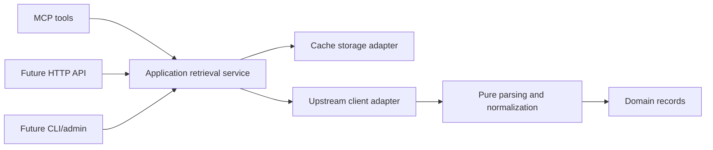

# Planned Rust architecture

## Status and decisions

This is the architecture contract for backend bootstrap, not a description of
existing Rust code. No crates, endpoints, storage engine, or CI workflow exist yet.

- Support multiple jurisdictions without imposing one provider's identity or
  date semantics on all records.
- Start provider coverage with Korean national legislation and history.
- Serve hosted MCP first, with a possible public HTTP API sharing application services.
- Start with one hosted backend instance. Multiple replicas require the
  [coordination design](upstream-policy.md#coordination-and-request-budgets).
- Keep a small workspace, extracting additional crates only for an identified need.

## Proposed responsibility map

All paths below are future locations. Introduce them with their implementations;
do not create empty crates or placeholder directories merely to complete the map.

| Future component | Responsibility | Project dependencies |
| --- | --- | --- |
| `crates/domain` | Legal identifiers, records, date/revision representations, provenance, domain errors | No other project layer |
| `crates/normalization` | Pure parsing and provider-specific normalization modules | Domain |
| `crates/application` | Retrieval use cases, freshness decisions, refresh orchestration, coalescing and budgets; upstream/storage interfaces | Domain |
| `crates/adapters` | Separate modules for upstream HTTP clients and cache-storage implementations | Application interfaces, domain, normalization |
| `apps/server` | Composition/configuration loading, hosted MCP tool layer, later separate HTTP handler modules | Application and adapters |
| `apps/cli` | Future CLI/admin commands and composition | Application and adapters; not server routing |

Within adapters, keep each provider's transport and each storage implementation in
responsibility-focused modules. The adapters crate is not a general utility crate.

## Dependency and side-effect boundaries

Domain code owns representations and invariants, not network, storage, filesystem,
MCP, or HTTP-server behavior. It must not depend on those implementations.

Parsing and normalization accept supplied bytes/values and explicit context and
return typed records, diagnostics, or errors. They do not read files, contact
networks, access databases or environment variables, read the clock, or depend on
MCP/HTTP serving. Fetching referenced resources is an explicit application action,
never a parser side effect. Keep provider-specific mapping modules distinct.

Application services define narrow interfaces for upstream and storage operations.
Concrete adapters implement those interfaces; application code does not import the
adapters crate. Put operation policy in application services and mechanics in
adapters. In particular, storage does not decide legal freshness, and transport
does not create an independent retry loop outside the shared request budget.

The composition entrypoint loads configuration, constructs adapters and shared
state, and connects them to application services. Explicitly supply time and other
environmental dependencies to policy logic so it can be tested deterministically.

## Retrieval flow

Arrows show execution flow, not Cargo dependencies. Application operations use
their interfaces; the entrypoint wires concrete adapters. An upstream adapter may
pass retrieved bytes to the normalizer, but the normalizer never initiates I/O.

Application services select cached data, arrange bounded/coalesced refresh when
needed, and publish validated records and provenance through storage interfaces.
They expose enough retrieval metadata for transports to honor the
[freshness contract](upstream-policy.md#freshness-and-failure-behavior).

## Transport and administration boundaries

MCP and future HTTP handlers validate transport inputs, map them to application
operations, and map results/errors to their protocol. Neither layer implements a
second legal-data model or independently fetches upstream data. Public outputs
must preserve record/revision identity, citations, and relevant freshness and
uncertainty; they must not expose credentials or internal diagnostic details.

CLI/admin commands use the same operation policies. A separate administrative
process must coordinate with the hosted backend or operate under an explicitly
isolated maintenance procedure; it cannot silently run a second unbudgeted crawler.
No public cache-bypass or unrestricted URL-fetching interface is implied here.

Exact Rust traits, wire schemas, MCP SDK/transport details, HTTP framework, and
authentication are backend implementation decisions. Propose and document these
interfaces with the implementation and their applicable review evidence.

## Tests and fixtures

Place unit tests with their owning modules and integration tests in the owning
crate's `tests/` directory. Introduce `tests/fixtures/` for genuinely shared source
fixtures, organized by provider and dataset. A virtual workspace root does not
automatically execute loose integration tests: attach cross-component tests to an
owning package or introduce a dedicated test package when justified.

Pure transformations use deterministic fixtures. Retrieval/cache tests use mock
upstreams, controlled clocks, and isolated storage. Fixture provenance and
sanitization follow the [legal-data policy](legal-data-policy.md#retained-evidence-and-fixtures).
Execution requirements live in [Contributing](../CONTRIBUTING.md#testing-and-ci).

## Evolving the structure

Extract a crate when independent dependencies, feature isolation, reuse, ownership,
or deployment needs justify it. Separate provider clients, storage, MCP, HTTP, or
CLI crates are options as their responsibilities grow, not bootstrap requirements.
Do not force unrelated responsibilities into an existing module or introduce
dispatch, boxed futures, tasks, locks, channels, or unconditional cloning solely
to cross a new module boundary. Choose those mechanisms for an explained need.

Changes to dependency direction or shared public contracts update this document
and explain the tradeoff. Introduce a separate decision record only when the
decision warrants more history than this document and the PR can usefully hold.
